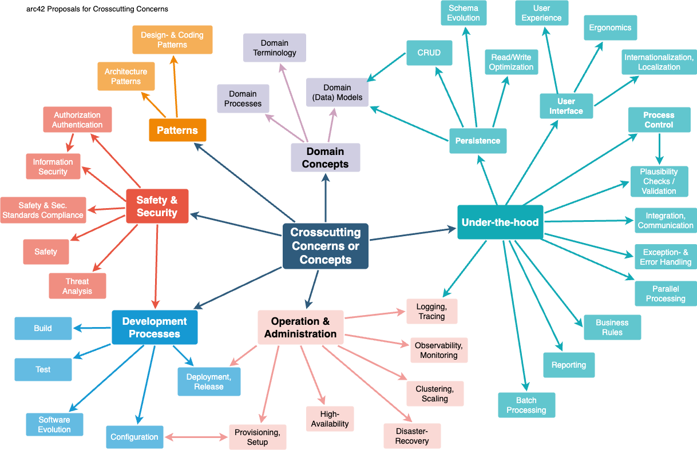

# 

**About arc42**

arc42, the template for documentation of software and system
architecture.

Template Version 9.0-EN. (based upon AsciiDoc version), July 2025

Created, maintained and © by Dr. Peter Hruschka, Dr. Gernot Starke and
contributors. See <https://arc42.org>.

> [!NOTE]
> This version of the template contains some help and explanations. It
> is used for familiarization with arc42 and the understanding of the
> concepts. For documentation of your own system you use better the
> *plain* version.

# Introduction and Goals

Describes the relevant requirements and the driving forces that software
architects and development team must consider. These include

- underlying business goals,

- essential features,

- essential functional requirements,

- quality goals for the architecture and

- relevant stakeholders and their expectations

## Requirements Overview

Contents

Short description of the functional requirements, driving forces,
extract (or abstract) of requirements. Link to (hopefully existing)
requirements documents (with version number and information where to
find it).

Motivation

From the point of view of the end users a system is created or modified
to improve support of a business activity and/or improve the quality.

Form

Short textual description, probably in tabular use-case format. If
requirements documents exist this overview should refer to these
documents.

Keep these excerpts as short as possible. Balance readability of this
document with potential redundancy w.r.t to requirements documents.

Further Information

See [Introduction and Goals](https://docs.arc42.org/section-1/) in the
arc42 documentation.

## Quality Goals

Contents

The top three (max five) quality goals for the architecture whose
fulfillment is of highest importance to the major stakeholders. We
really mean quality goals for the architecture. Don’t confuse them with
project goals. They are not necessarily identical.

Consider this overview of potential topics (based upon the ISO 25010
standard):

<figure>

</figure>

Motivation

You should know the quality goals of your most important stakeholders,
since they will influence fundamental architectural decisions. Make sure
to be very concrete about these qualities, avoid buzzwords. If you as an
architect do not know how the quality of your work will be judged…​

Form

A table with quality goals and concrete scenarios, ordered by priorities

## Stakeholders

Contents

Explicit overview of stakeholders of the system, i.e. all person, roles
or organizations that

- should know the architecture

- have to be convinced of the architecture

- have to work with the architecture or with code

- need the documentation of the architecture for their work

- have to come up with decisions about the system or its development

Motivation

You should know all parties involved in development of the system or
affected by the system. Otherwise, you may get nasty surprises later in
the development process. These stakeholders determine the extent and the
level of detail of your work and its results.

Form

Table with role names, person names, and their expectations with respect
to the architecture and its documentation.

| Role/Name    | Contact         | Expectations        |
|--------------|-----------------|---------------------|
| *\<Role-1\>* | *\<Contact-1\>* | *\<Expectation-1\>* |
| *\<Role-2\>* | *\<Contact-2\>* | *\<Expectation-2\>* |

# Architecture Constraints

Contents

Any requirement that constraints software architects in their freedom of
design and implementation decisions or decision about the development
process. These constraints sometimes go beyond individual systems and
are valid for whole organizations and companies.

Motivation

Architects should know exactly where they are free in their design
decisions and where they must adhere to constraints. Constraints must
always be dealt with; they may be negotiable, though.

Form

Simple tables of constraints with explanations. If needed you can
subdivide them into technical constraints, organizational and political
constraints and conventions (e.g. programming or versioning guidelines,
documentation or naming conventions)

Further Information

See [Architecture Constraints](https://docs.arc42.org/section-2/) in the
arc42 documentation.

# Context and Scope

Contents

Context and scope - as the name suggests - delimits your system (i.e.
your scope) from all its communication partners (neighboring systems and
users, i.e. the context of your system). It thereby specifies the
external interfaces.

If necessary, differentiate the business context (domain specific inputs
and outputs) from the technical context (channels, protocols, hardware).

Motivation

The domain interfaces and technical interfaces to communication partners
are among your system’s most critical aspects. Make sure that you
completely understand them.

Form

Various options:

- Context diagrams

- Lists of communication partners and their interfaces.

Further Information

See [Context and Scope](https://docs.arc42.org/section-3/) in the arc42
documentation.

## Business Context

Contents

Specification of **all** communication partners (users, IT-systems, …​)
with explanations of domain specific inputs and outputs or interfaces.
Optionally you can add domain specific formats or communication
protocols.

Motivation

All stakeholders should understand which data are exchanged with the
environment of the system.

Form

All kinds of diagrams that show the system as a black box and specify
the domain interfaces to communication partners.

Alternatively (or additionally) you can use a table. The title of the
table is the name of your system, the three columns contain the name of
the communication partner, the inputs, and the outputs.

**\<Diagram or Table\>**

**\<optionally: Explanation of external domain interfaces\>**

## Technical Context

Contents

Technical interfaces (channels and transmission media) linking your
system to its environment. In addition a mapping of domain specific
input/output to the channels, i.e. an explanation which I/O uses which
channel.

Motivation

Many stakeholders make architectural decision based on the technical
interfaces between the system and its context. Especially infrastructure
or hardware designers decide these technical interfaces.

Form

E.g. UML deployment diagram describing channels to neighboring systems,
together with a mapping table showing the relationships between channels
and input/output.

**\<Diagram or Table\>**

**\<optionally: Explanation of technical interfaces\>**

**\<Mapping Input/Output to Channels\>**

# Solution Strategy

Contents

A short summary and explanation of the fundamental decisions and
solution strategies, that shape system architecture. It includes

- technology decisions

- decisions about the top-level decomposition of the system, e.g. usage
  of an architectural pattern or design pattern

- decisions on how to achieve key quality goals

- relevant organizational decisions, e.g. selecting a development
  process or delegating certain tasks to third parties.

Motivation

These decisions form the cornerstones for your architecture. They are
the foundation for many other detailed decisions or implementation
rules.

Form

Keep the explanations of such key decisions short.

Motivate what was decided and why it was decided that way, based upon
problem statement, quality goals and key constraints. Refer to details
in the following sections.

Further Information

See [Solution Strategy](https://docs.arc42.org/section-4/) in the arc42
documentation.

# Building Block View

Content

The building block view shows the static decomposition of the system
into building blocks (modules, components, subsystems, classes,
interfaces, packages, libraries, frameworks, layers, partitions, tiers,
functions, macros, operations, data structures, …​) as well as their
dependencies (relationships, associations, …​)

This view is mandatory for every architecture documentation. In analogy
to a house this is the *floor plan*.

Motivation

Maintain an overview of your source code by making its structure
understandable through abstraction.

This allows you to communicate with your stakeholder on an abstract
level without disclosing implementation details.

Form

The building block view is a hierarchical collection of black boxes and
white boxes (see figure below) and their descriptions.

<figure>

</figure>

**Level 1** is the white box description of the overall system together
with black box descriptions of all contained building blocks.

**Level 2** zooms into some building blocks of level 1. Thus it contains
the white box description of selected building blocks of level 1,
together with black box descriptions of their internal building blocks.

**Level 3** zooms into selected building blocks of level 2, and so on.

Further Information

See [Building Block View](https://docs.arc42.org/section-5/) in the
arc42 documentation.

## Whitebox Overall System

Here you describe the decomposition of the overall system using the
following white box template. It contains

- an overview diagram

- a motivation for the decomposition

- black box descriptions of the contained building blocks. For these we
  offer you alternatives:

  - use *one* table for a short and pragmatic overview of all contained
    building blocks and their interfaces

  - use a list of black box descriptions of the building blocks
    according to the black box template (see below). Depending on your
    choice of tool this list could be sub-chapters (in text files),
    sub-pages (in a Wiki) or nested elements (in a modeling tool).

- (optional:) important interfaces, that are not explained in the black
  box templates of a building block, but are very important for
  understanding the white box. Since there are so many ways to specify
  interfaces why do not provide a specific template for them. In the
  worst case you have to specify and describe syntax, semantics,
  protocols, error handling, restrictions, versions, qualities,
  necessary compatibilities and many things more. In the best case you
  will get away with examples or simple signatures.

***\<Overview Diagram\>***

Motivation  
*\<text explanation\>*

Contained Building Blocks  
*\<Description of contained building block (black boxes)\>*

Important Interfaces  
*\<Description of important interfaces\>*

Insert your explanations of black boxes from level 1:

If you use tabular form you will only describe your black boxes with
name and responsibility according to the following schema:

| **Name**          | **Responsibility** |
|-------------------|--------------------|
| *\<black box 1\>* |  *\<Text\>*        |
| *\<black box 2\>* |  *\<Text\>*        |

If you use a list of black box descriptions then you fill in a separate
black box template for every important building block . Its headline is
the name of the black box.

### \<Name black box 1\>

Here you describe \<black box 1\> according the the following black box
template:

- Purpose/Responsibility

- Interface(s), when they are not extracted as separate paragraphs. This
  interfaces may include qualities and performance characteristics.

- (Optional) Quality-/Performance characteristics of the black box,
  e.g.availability, run time behavior, …​.

- (Optional) directory/file location

- (Optional) Fulfilled requirements (if you need traceability to
  requirements).

- (Optional) Open issues/problems/risks

*\<Purpose/Responsibility\>*

*\<Interface(s)\>*

*\<(Optional) Quality/Performance Characteristics\>*

*\<(Optional) Directory/File Location\>*

*\<(Optional) Fulfilled Requirements\>*

*\<(optional) Open Issues/Problems/Risks\>*

### \<Name black box 2\>

*\<black box template\>*

### \<Name black box n\>

*\<black box template\>*

### \<Name interface 1\>

…​

### \<Name interface m\>

## Level 2

Here you can specify the inner structure of (some) building blocks from
level 1 as white boxes.

You have to decide which building blocks of your system are important
enough to justify such a detailed description. Please prefer relevance
over completeness. Specify important, surprising, risky, complex or
volatile building blocks. Leave out normal, simple, boring or
standardized parts of your system

### White Box *\<building block 1\>*

…​describes the internal structure of *building block 1*.

*\<white box template\>*

### White Box *\<building block 2\>*

*\<white box template\>*

…​

### White Box *\<building block m\>*

*\<white box template\>*

## Level 3

Here you can specify the inner structure of (some) building blocks from
level 2 as white boxes.

When you need more detailed levels of your architecture please copy this
part of arc42 for additional levels.

### White Box \<\_building block x.1\_\>

Specifies the internal structure of *building block x.1*.

*\<white box template\>*

### White Box \<\_building block x.2\_\>

*\<white box template\>*

### White Box \<\_building block y.1\_\>

*\<white box template\>*

# Runtime View

Contents

The runtime view describes concrete behavior and interactions of the
system’s building blocks in form of scenarios from the following areas:

- important use cases or features: how do building blocks execute them?

- interactions at critical external interfaces: how do building blocks
  cooperate with users and neighboring systems?

- operation and administration: launch, start-up, stop

- error and exception scenarios

Remark: The main criterion for the choice of possible scenarios
(sequences, workflows) is their **architectural relevance**. It is
**not** important to describe a large number of scenarios. You should
rather document a representative selection.

Motivation

You should understand how (instances of) building blocks of your system
perform their job and communicate at runtime. You will mainly capture
scenarios in your documentation to communicate your architecture to
stakeholders that are less willing or able to read and understand the
static models (building block view, deployment view).

Form

There are many notations for describing scenarios, e.g.

- numbered list of steps (in natural language)

- activity diagrams or flow charts

- sequence diagrams

- BPMN or EPCs (event process chains)

- state machines

- …​

Further Information

See [Runtime View](https://docs.arc42.org/section-6/) in the arc42
documentation.

## \<Runtime Scenario 1\>

- *\<insert runtime diagram or textual description of the scenario\>*

- *\<insert description of the notable aspects of the interactions
  between the building block instances depicted in this diagram.\>*

## \<Runtime Scenario 2\>

## …​

## \<Runtime Scenario n\>

# Deployment View

Content

The deployment view describes:

1.  technical infrastructure used to execute your system, with
    infrastructure elements like geographical locations, environments,
    computers, processors, channels and net topologies as well as other
    infrastructure elements and

2.  mapping of (software) building blocks to that infrastructure
    elements.

Often systems are executed in different environments, e.g. development
environment, test environment, production environment. In such cases you
should document all relevant environments.

Especially document a deployment view if your software is executed as
distributed system with more than one computer, processor, server or
container or when you design and construct your own hardware processors
and chips.

From a software perspective it is sufficient to capture only those
elements of an infrastructure that are needed to show a deployment of
your building blocks. Hardware architects can go beyond that and
describe an infrastructure to any level of detail they need to capture.

Motivation

Software does not run without hardware. This underlying infrastructure
can and will influence a system and/or some cross-cutting concepts.
Therefore, there is a need to know the infrastructure.

Form

Maybe a highest level deployment diagram is already contained in section
3.2. as technical context with your own infrastructure as ONE black box.
In this section one can zoom into this black box using additional
deployment diagrams:

- UML offers deployment diagrams to express that view. Use it, probably
  with nested diagrams, when your infrastructure is more complex.

- When your (hardware) stakeholders prefer other kinds of diagrams
  rather than a deployment diagram, let them use any kind that is able
  to show nodes and channels of the infrastructure.

Further Information

See [Deployment View](https://docs.arc42.org/section-7/) in the arc42
documentation.

## Infrastructure Level 1

Describe (usually in a combination of diagrams, tables, and text):

- distribution of a system to multiple locations, environments,
  computers, processors, .., as well as physical connections between
  them

- important justifications or motivations for this deployment structure

- quality and/or performance features of this infrastructure

- mapping of software artifacts to elements of this infrastructure

For multiple environments or alternative deployments please copy and
adapt this section of arc42 for all relevant environments.

***\<Overview Diagram\>***

Motivation  
*\<explanation in text form\>*

Quality and/or Performance Features  
*\<explanation in text form\>*

Mapping of Building Blocks to Infrastructure  
*\<description of the mapping\>*

## Infrastructure Level 2

Here you can include the internal structure of (some) infrastructure
elements from level 1.

Please copy the structure from level 1 for each selected element.

### *\<Infrastructure Element 1\>*

*\<diagram + explanation\>*

### *\<Infrastructure Element 2\>*

*\<diagram + explanation\>*

…​

### *\<Infrastructure Element n\>*

*\<diagram + explanation\>*

# Cross-cutting Concepts

Content

This section describes crosscutting concepts (practices, patterns,
regulations or solution ideas). Such concepts are often related to
multiple building blocks. They may include many different topics, such
as the topics shown in the following diagram:

<figure>

</figure>

Motivation

Concepts form the basis for *conceptual integrity* (consistency,
homogeneity) of the architecture. Thus, they are an important
contribution to achieve inner qualities of your system.

This is the place in the template that we provided for a cohesive
specification of such concepts.

Many of these concepts relate to or influence several of your building
blocks.

Form

The form can be varied:

- concept papers with any kind of structure

- example implementations,especially for technical concepts

- cross-cutting model excerpts or scenarios using notations of the
  architecture views

Structure

Pick **only** the most-needed topics for your system and assign each a
level-2 heading in this section (e.g. 8.1, 8.2 etc).

DO NOT ATTEMPT to cover all of the topics of the aforementioned diagram.

Further Information

Some topics within systems often concern multiple building blocks,
hardware elements or development processes. It might be easier to
communicate or document such *cross-cutting* topics at a central
location, instead of repeating them in the description of the concerned
building blocks, hardware elements or development processes.

Certain concepts might concern **all** elements of a system, others
might only be relevant for a few. In the diagram above, logging concerns
all three components, whereas security is relevant only for two
components.

See [Concepts](https://docs.arc42.org/section-8/) in the arc42
documentation.

## *\<Concept 1\>*

*\<explanation\>*

## *\<Concept 2\>*

*\<explanation\>*

…​

## *\<Concept n\>*

*\<explanation\>*

# Architecture Decisions

Contents

Important, expensive, large scale or risky architecture decisions
including rationales. With "decisions" we mean selecting one alternative
based on given criteria.

Please use your judgement to decide whether an architectural decision
should be documented here in this central section or whether you better
document it locally (e.g. within the white box template of one building
block).

Avoid redundancy. Refer to section 4, where you already captured the
most important decisions of your architecture.

Motivation

Stakeholders of your system should be able to comprehend and retrace
your decisions.

Form

Various options:

- ADR ([Documenting Architecture
  Decisions](https://cognitect.com/blog/2011/11/15/documenting-architecture-decisions))
  for every important decision

- List or table, ordered by importance and consequences or:

- more detailed in form of separate sections per decision

Further Information

See [Architecture Decisions](https://docs.arc42.org/section-9/) in the
arc42 documentation. There you will find links and examples about ADR.

# Quality Requirements

Content

This section contains all relevant quality requirements.

The most important of these requirements have already been described in
section 1.2. (quality goals), therefore they should only be referenced
here. In this section 10 you should also capture quality requirements
with lesser importance, which will not create high risks when they are
not fully achieved (but might be *nice-to-have*).

Motivation

Since quality requirements will have a lot of influence on architectural
decisions you should know what qualities are really important for your
stakeholders, in a specific and measurable way.

Further Information

- See [Quality Requirements](https://docs.arc42.org/section-10/) in the
  arc42 documentation.

- See the extensive [Q42 quality model on
  https://quality.arc42.org](https://quality.arc42.org).

## Quality Requirements Overview

Content

An overview or summary of quality requirements.

Motivation

Often we encounter dozens (or even hundreds) of detailed quality
requirements. In this overview section you should try to summarize, e.g.
by describing categories or topics (as suggested by [ISO
25010:2023](https://www.iso.org/obp/ui/#iso:std:iso-iec:25010:ed-2:v1:en)
or [Q42](https://quality.arc42.org))

If these summary descriptions are already precise, specific enough and
measurable, you may skip section 10.2.

Form

Use a simple table in which each line contains a category or topic and a
short description of the quality requirement. Alternatively, you may use
a mindmap to structure these quality requirements. In literature, the
idea of a *quality attribute tree* has also been described, which puts
the generic term "quality" as the root and uses a tree-like refinement
of the term "quality". \[Bass+21\] introduced the term "Quality
Attribute Utility Tree" for this purpose.

## Quality Scenarios

Content

Quality scenarios make quality requirements concrete and allow to decide
whether they are fulfilled (in the sense of acceptance criteria). Ensure
that your scenarios are specific and measurable.

Two kinds of scenarios are especially useful:

- *Usage scenarios* (also called application scenarios or use case
  scenarios) describe the system’s runtime reaction to a certain
  stimulus. This also includes scenarios that describe the system’s
  efficiency or performance. Example: The system reacts to a user’s
  request within one second.

- *Change scenarios* describe the desired effect of a modification or
  extension of the system or of its immediate environment. Example:
  Additional functionality is implemented or requirements for a quality
  attribute change, and the effort or duration of the change is
  measured.

Form

Typical information for detailed scenarios include the following:

In short form (favoured in the Q42 model):

- **Context/Background**: What kind of system or component, what is the
  envirionment or situation?

- **Source/Stimulus**: Who or what initiates or triggers a behaviour,
  reaction or action.

- **Metric/Acceptance Criteria**: A response including a *measure* or
  *metric*

The long form of scenarios (favoured by the SEI and \[Bass+21\]) is more
detailed and includes the following information:

- **Scenario ID**: A unique identifier for the scenario.

- **Scenario Name**: A short, descriptive name for the scenario.

- **Source**: The entity (user, system, or event) that initiates the
  scenario.

- **Stimulus**: The triggering event or condition the system must
  address.

- **Environment**: The operational context or condition under which the
  system experiences the stimulus.

- **Artifact**: The building-blocks or other elements of the system
  affected by the stimulus.

- **Response**: The outcome or behavior the system exhibits in reaction
  to the stimulus.

- **Response Measure**: The criteria or metric by which the system’s
  response is evaluated.

Examples

See [the Q42 quality model website](https://quality.arc42.org) for
detailes examples of quality requirements.

Further Information

- Len Bass, Paul Clements, Rick Kazman: "Software Architecture in
  Practice", 4th Edition, Addison-Wesley, 2021.

# Risks and Technical Debts

Contents

A list of identified technical risks or technical debts, ordered by
priority

Motivation

“Risk management is project management for grown-ups” (Tim Lister,
Atlantic Systems Guild.)

This should be your motto for systematic detection and evaluation of
risks and technical debts in the architecture, which will be needed by
management stakeholders (e.g. project managers, product owners) as part
of the overall risk analysis and measurement planning.

Form

List of risks and/or technical debts, probably including suggested
measures to minimize, mitigate or avoid risks or reduce technical debts.

Further Information

See [Risks and Technical Debt](https://docs.arc42.org/section-11/) in
the arc42 documentation.

# Glossary

Contents

The most important domain and technical terms that your stakeholders use
when discussing the system.

You can also see the glossary as source for translations if you work in
multi-language teams.

Motivation

You should clearly define your terms, so that all stakeholders

- have an identical understanding of these terms

- do not use synonyms and homonyms

Form

A table with columns \<Term\> and \<Definition\>.

Potentially more columns in case you need translations.

Further Information

See [Glossary](https://docs.arc42.org/section-12/) in the arc42
documentation.

| Term         | Definition         |
|--------------|--------------------|
| *\<Term-1\>* | *\<definition-1\>* |
| *\<Term-2\>* | *\<definition-2\>* |
